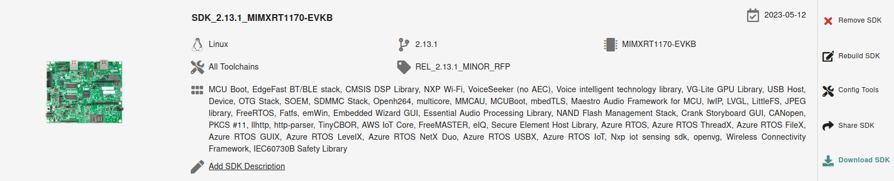

# OpenThread on NXP RT1170 (host) + transceiver (rcp) example

This directory contains example platform drivers for the [NXP RT1170][rt1170] platform.

The example platform drivers are intended to present the minimal code necessary to support OpenThread. As a result, the example platform drivers do not necessarily highlight the platform's full capabilities.

[rt1170]: https://www.nxp.com/products/processors-and-microcontrollers/arm-microcontrollers/i-mx-rt-crossover-mcus/i-mx-rt1170-crossover-mcu-family-first-ghz-mcu-with-arm-cortex-m7-and-cortex-m4-cores:i.MX-RT1170?cid=ad_PRG4692582_TAC476846_EETECH_IMXRT1170&gclid=EAIaIQobChMIvr3xrYzT8QIVTgKLCh3GGQ80EAAYAiAAEgLnYvD_BwE

## Configuration(s) supported

Here are listed configurations that allow to support Openthread on RT1170:

- RT1170 + IWX12

## Prerequisites

Before you start building the examples, you must download and install the toolchain and the tools required for flashing and debugging.

## Toolchain

OpenThread environment is suited to be run on a Linux-based OS.

In a Bash terminal (found, for example, in Ubuntu OS), follow these instructions to install the GNU toolchain and other dependencies.

```bash
$ cd <path-to-ot-nxp>
$ ./script/bootstrap
```

## Tools

- Download and install the [MCUXpresso IDE][mcuxpresso ide].

[mcuxpresso ide]: https://www.nxp.com/support/developer-resources/software-development-tools/mcuxpresso-software-and-tools/mcuxpresso-integrated-development-environment-ide:MCUXpresso-IDE

- Download the [IMXRT1170 SDK](https://mcuxpresso.nxp.com/).
  Creating an nxp.com account is required before being able to download the
  SDK. Once the account is created, login and follow the steps for downloading
  SDK. The SDK Builder UI selection should be similar with the one from the image below with the **FreeRTOS component**, the **BT/BLE component** and the **ARM GCC Toolchain** selected.



Please refer to release notes for getting the latest released SDK.

Note: if the IWX12 transceiver is chosen a dedicated SDK with this support should be chosen.

## Hardware requirements RT1170 + IWX12

Host part:

- 1 EVK-MIMXRT1170

Transceiver part:

- 1 WIFI IWX12 BOARD RD USD

### Hardware rework for SPI support on EVK-MIMXRT1170

To support SPI on the EVK-MIMXRT1170 board, it is required to remove 0Ω resistors R404,R406,R408.

### Board settings (Spinel over SPI)

The below table explains pin settings (SPI settings) to connect the evkmimxrt1170 (host) to a IWX12 transceiver (rcp).

| PIN NAME OF IWX12 |    IWX12    | I.MXRT1170  | PIN NAME OF RT1170 | GPIO NAME OF RT1170 |
| :---------------: | :---------: | :---------: | :----------------: | :-----------------: |
|        SIN        | J10, pin 19 | J10, pin 8  |    LPSPI1_SOUT     |     GPIO_AD_30      |
|       SOUT        | J10, pin 21 | J10, pin 10 |     LPSPI1_SIN     |     GPIO_AD_31      |
|       PCS0        | J10, pin 24 | J10, pin 6  |    LPSPI1_PCS0     |     GPIO_AD_29      |
|        SCK        | J10, pin 23 | J10, pin 12 |     LPSPI1_SCK     |     GPIO_AD_28      |
|        GND        | J10, pin 9  | J10, pin 14 |         XX         |         XX          |
|       RESET       | J10, pin 37 | J26, pin 2  |     GPIO_AD_10     |     GPIO_AD_10      |
|      SPI_INT      | J10, pin 15 | J26, pin 4  |     GPIO_AD_11     |     GPIO_AD_11      |

Hardware rework for IWX12 board:

- Populate a 0 ohm resistor in R97, it’s an 0201 size resistor footprint.

The jumper settings for IWX12 board:

- Connect JP19
- Disconnect JP16

Power for IWX12 board:

- Use external 5V power supply

For IWX12 running on QFN_IPA board an external antenna should be plugged on ANT3 J4.
The IWX12 board should be plugged to the RT1170 via SDIO.

### Building the freeRTOS ot-cli example

```bash
$ cd <path-to-ot-nxp>
$ export NXP_RT1170_SDK_ROOT=/path/to/previously/downloaded/SDK
$ ./script/build_rt1170 iwx12_spi
```

After a successful build, the ot-cli-rt1170.elf FreeRTOS version could be found in `build_rt1170/iwx12/bin` and include support of the FTD (Full Thread Device) role.

## Hardware requirements RT1170 + K32W0 - Warning: No longer maintain

Host part:

- 1 EVK-MIMXRT1170

Transceiver part:

- 1 OM15076-3 Carrier Board (DK6 board)
- 1 K32W061 Module to be plugged on the Carrier Board

### Board settings (Spinel over UART)

The below table explains pin settings (UART settings) to connect the evkmimxrt1170 (host) to a k32w061 transceiver (rcp).

| PIN NAME OF K32W061 | DK6 (K32W061) | I.MXRT1170  | PIN NAME OF RT1170 | GPIO NAME OF RT1170 |
| :-----------------: | :-----------: | :---------: | :----------------: | :-----------------: |
|      UART_TXD       |     PIO 8     | J25, pin 13 |    LPUART7_RXD     |     GPIO_AD_01      |
|      UART_RXD       |     PIO 9     | J25, pin 15 |    LPUART7_TXD     |     GPIO_AD_00      |
|      UART_RTS       |     PIO 6     | J25, pin 11 |    LPUART7_CTS     |     GPIO_AD_02      |
|      UART_CTS       |     PIO 7     | J25, pin 9  |    LPUART7_RTS     |     GPIO_AD_03      |
|         GND         |   J3, pin 1   | J10, pin 14 |         XX         |         XX          |
|        RESET        |     RSTN      | J26, pin 2  |     GPIO_AD_10     |     GPIO_AD_10      |

### Building the freeRTOS ot-cli example

```bash
$ cd <path-to-ot-nxp>
$ export NXP_RT1170_SDK_ROOT=/path/to/previously/downloaded/SDK
$ ./script/build_rt1170 k32w0_uart_flow_control
```

After a successful build, the ot-cli-rt1170.elf FreeRTOS version could be found in `build_rt1170/k32w0_uart_flow_control/bin` and include support of the FTD (Full Thread Device) role.

## Flashing the IMXRT ot-cli-rt1170 host image using MCUXpresso IDE

In order to flash the application for debugging we recommend using [MCUXpresso IDE (version >= 11.3.1)](https://www.nxp.com/design/software/development-software/mcuxpresso-software-and-tools-/mcuxpresso-integrated-development-environment-ide:MCUXpresso-IDE?tab=Design_Tools_Tab).

- Import the previously downloaded NXP SDK into MCUXpresso IDE. This can be done by drag-and-dropping the SDK archive into MCUXpresso IDE.
- Follow the same procedure as described in [OpenThread on RT1060 examples][rt1060-page] in section "Flashing the IMXRT ot-cli-rt1060 host image using MCUXpresso IDE". Instead of selecting the RT1060 MCU, the RT1170 MCU should be chosen.

[rt1060-page]: ../rt1060/README.md

## Running the example

1. The CLI example uses UART connection. To view raw UART output, start a terminal emulator like PuTTY and connect to the used COM port with the following UART settings (on the IMXRT1170):

   - Baud rate: 115200
   - 8 data bits
   - 1 stop bit
   - No parity
   - No flow control

2. Follow the process describe in [Interact with the OT CLI][validate_port].

[validate_port]: https://openthread.io/guides/porting/validate-the-port#interact-with-the-cli

For a list of all available commands, visit [OpenThread CLI Reference README.md][cli].

[cli]: https://github.com/openthread/openthread/blob/master/src/cli/README.md

## Known issues

- Factory reset issue when the board is attacted to MCUXpresso debugguer: before running the factory reset command the debugguer needs to be detached.
