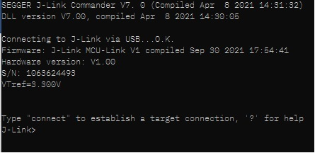

# OpenThread on NXP RW612 Example

This directory contains example platform drivers for the [NXP RW612] based on [RD-RW612-BGA] hardware platform, including all variants of devices.
The example platform drivers are intended to present the minimal code necessary to support OpenThread. As a result, the example platform drivers do not necessarily highlight the platform's full capabilities.

## Prerequisites

Before you start building the examples, you must download and install the toolchain and the tools required for flashing and debugging.

## Toolchain

OpenThread environment is suited to be run on a Linux-based OS (Ubuntu OS for example), WSL (Ubuntu 20.04 on Windows) or Windows (command line).
There are three tools that need to be installed:

- CMake
- ninja
- the arm-non-eabi gcc cross-compiler

Depending on system used installing each tool done differently.

### Linux-based

In a Bash terminal (found, for example, in Ubuntu OS), follow these instructions to install the GNU toolchain and other dependencies.

```bash
$ cd <path-to-ot-nxp>
$ ./script/bootstrap
```

### WSL (Ubuntu 20.05 on Windows)

Open the WSL console and type the following.

```bash
$ sudo apt install ninja-build cmake gcc-arm-none-eabi
```

### Windows

On this platform you have to install all the tools by downloading the installers:

- For the CMake get the downloader from the [official site](https://cmake.org) and install it
- For the ninja build system download the binary from the [official site](https://ninja-build.org). Place it in a path accessible from the windows command window.
- For the gcc-arm-non-eabi cross-compiler, download the installer from the [official site](https://developer.arm.com/downloads/-/gnu-rm) and install it

Make sure that the paths of all these tools are set into the `Path` system variable.

## Downloading the SDK

Before downloading the SDK you have to create an account at nxp.com. Once the account is created, login and follow the steps for downloading the SDK_2.13.0_RD-RW612-BGA.
To get the SDK go to the public [repo](https://mcuxpresso.nxp.com/) and select the RD-RW612-BGA (RW612) board

Click on "Build MCUXpresso SDK v2.13.0" button. On the next page select the desired Host OS and ALL for Toolchain/IDE. Additionaly `SELECT ALL` components and then press `DOWNLOAD SDK` button.
Once the SDK_2.13.0_RD-RW612-BGA.zip archive is downloaded unzip it and access the contents.


## Building the examples

### Linux-like environment

```bash
$ cd <path-to-ot-nxp>
$ export NXP_RW612_SDK_ROOT=/path/to/previously/downloaded/SDK
$ ./script/build_rw612
```

To build for a specific device revision such as A0:

```bash
$ cd <path-to-ot-nxp>
$ export NXP_RW612_SDK_ROOT=/path/to/previously/downloaded/SDK
$ ./script/build_rw612 -DOT_NXP_DEVICE_REVISION=A0
```

### Windows

```bash
$ cd <path-to-ot-nxp>
$ set NXP_RW612_SDK_ROOT=/path/to/previously/downloaded/SDK
$ script\build-rw612.bat
```

After a successful build, the `elf` and `binary` files are found in `build_rw612/bin`:

- ot-cli-rw612 (the elf image)
- ot-cli-rw612.bin (the binary)

## Flash Binaries

To flash the binaries we use the JLink from Segger. You can download it and install it from https://www.segger.com/products/debug-probes/j-link.
Once it is install to flash the images run JLink from the command line (either windows or linux):

```bash
$ JLink
```

You will be presented with a menu like:



Run the following commands:

```bash
J-Link> connect
Device> ? # you will be presented with a dialog -> select `CORTEX-M33`
Please specify target interface:
 J) JTAG (Default)
 S) SWD
 T) cJTAG
TIF> S
Specify target interface speed [kHz]. <Default>: 4000 kHz
Speed> # <enter>
```

If successfull you will see the following screen:


At this point flush the image with the following command

```bash
J-Link> loadbin path/to/binary,0x08000000
```

## Running the example

1. Prepare two boards with the flashed `CLI Example` (as shown above).
2. The CLI example uses UART connection. To view raw UART output, start a terminal emulator like PuTTY and connect to the used COM port with the following UART settings:

   - Baud rate: 115200
   - 8 data bits
   - 1 stop bit
   - No parity
   - No flow control

3. Open a terminal connection on the first board and start a new Thread network.

```bash
> panid 0xabcd
Done
> ifconfig up
Done
> thread start
Done
```

4. After a couple of seconds the node will become a Leader of the network.

```bash
> state
Leader
```

5. Open a terminal connection on the second board and attach a node to the network.

```bash
> panid 0xabcd
Done
> ifconfig up
Done
> thread start
Done
```

6. After a couple of seconds the second node will attach and become a Child.

```bash
> state
Child
```

7. List all IPv6 addresses of the first board.

```bash
> ipaddr
fdde:ad00:beef:0:0:ff:fe00:fc00
fdde:ad00:beef:0:0:ff:fe00:9c00
fdde:ad00:beef:0:4bcb:73a5:7c28:318e
fe80:0:0:0:5c91:c61:b67c:271c
```

8. Choose one of them and send an ICMPv6 ping from the second board.

```bash
> ping fdde:ad00:beef:0:0:ff:fe00:fc00
16 bytes from fdde:ad00:beef:0:0:ff:fe00:fc00: icmp_seq=1 hlim=64 time=8ms
```

For a list of all available commands, visit [OpenThread CLI Reference README.md][cli].

[cli]: https://github.com/openthread/openthread/blob/main/src/cli/README.md
